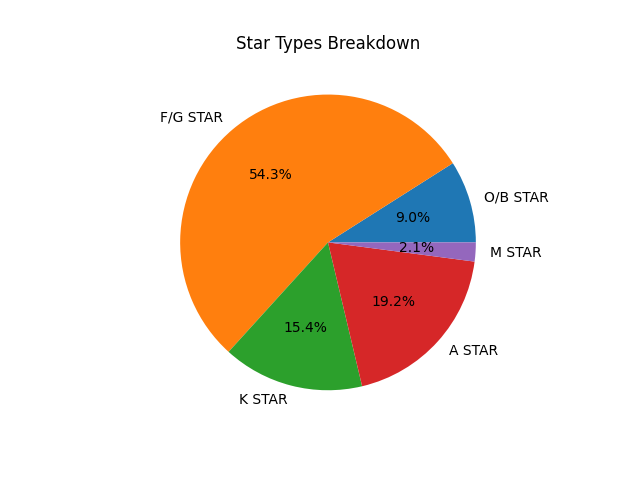
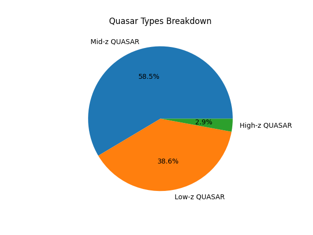
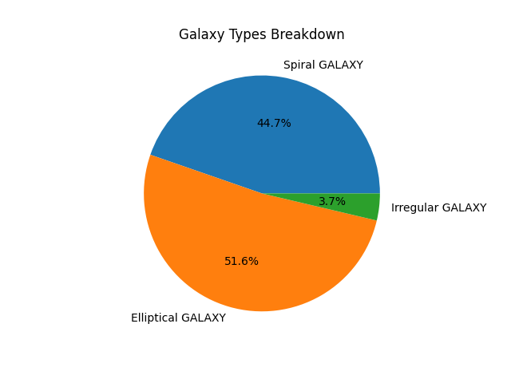

# ML-based-GALAXY-STAR-and-QUASAR-classification
~~~

 ░▒▓███████▓▒░   ░▒▓██████▓▒░    ░▒▓██████▓▒░    ░▒▓██████▓▒░  
░▒▓█▓▒░         ░▒▓█▓▒  ▒▓█▓▒░  ░▒▓█▓▒  ▒▓█▓▒░  ░▒▓█▓▒  ▒▓█▓▒░ 
░▒▓█▓▒░         ░▒▓█▓▒          ░▒▓█▓▒  ▒▓█▓▒░  ░▒▓█▓▒       
 ░▒▓██████▓▒░   ░▒▓█▓▒▒▓███▓▒░  ░▒▓█▓▒  ▒▓█▓▒░  ░▒▓█▓▒        
       ░▒▓█▓▒░  ░▒▓█▓▒  ▒▓█▓▒░  ░▒▓█▓▒  ▒▓█▓▒░  ░▒▓█▓▒        
       ░▒▓█▓▒░  ░▒▓█▓▒  ▒▓█▓▒░  ░▒▓█▓▒  ▒▓█▓▒░  ░▒▓█▓▒   ▒▓█▓▒░ 
░▒▓███████▓▒░    ░▒▓██████▓▒░   ░▒▓██████▓▒░     ░▒▓██████▓▒░  
                                 ░▒▓█▓▒░                   
    STAR          GALAXY         QUASAR           CLASSIFICATION

~~~
# TRAIN RANDOM FOREST MODEL
~~~
import pandas as pd
import numpy as np
import joblib
import matplotlib.pyplot as plt
import seaborn as sns

from sklearn.model_selection import train_test_split, GridSearchCV
from sklearn.ensemble import RandomForestClassifier
from sklearn.metrics import classification_report, confusion_matrix, accuracy_score
from sklearn.preprocessing import LabelEncoder

df = pd.read_csv('data/SDSS_DR18.csv')
df = df.dropna(subset=['u', 'g', 'r', 'i', 'z', 'redshift', 'class'])

# Feature
df['u-g'] = df['u'] - df['g']
df['g-r'] = df['g'] - df['r']
df['r-i'] = df['r'] - df['i']
df['i-z'] = df['i'] - df['z']
df['u-r'] = df['u'] - df['r']
df['g-i'] = df['g'] - df['i']
df['r-z'] = df['r'] - df['z']
df['g/r'] = df['g'] / df['r']
df['r/i'] = df['r'] / df['i']
df['(u-g)/(g-r)'] = df['u-g'] / df['g-r']
df['log_redshift'] = np.log10(df['redshift'] + 1)

label_encoder = LabelEncoder()
df['object_class_encoded'] = label_encoder.fit_transform(df['class'])

features = [
    'u-g', 'g-r', 'r-i', 'i-z', 'u-r', 'g-i', 'r-z',
    'g/r', 'r/i', '(u-g)/(g-r)', 'log_redshift'
]

X = df[features]
y = df['object_class_encoded']

X_train, X_test, y_train, y_test = train_test_split(X, y, test_size=0.2, random_state=42)

# GridSearch
param_grid = {
    'n_estimators': [100, 200],
    'max_depth': [None, 20, 30],
    'min_samples_split': [2, 5],
    'min_samples_leaf': [1, 2],
    'class_weight': [None, 'balanced']
}

print("Tuning Random Forest parameters, please wait...")
grid_search = GridSearchCV(RandomForestClassifier(random_state=42),
                           param_grid, cv=3, n_jobs=-1, verbose=1)
grid_search.fit(X_train, y_train)

best_model = grid_search.best_estimator_
print("\nBest Parameters:", grid_search.best_params_)

# Evaluation
y_pred = best_model.predict(X_test)
print("\nClassification Report:")
print(classification_report(y_test, y_pred, target_names=label_encoder.classes_))
print("Accuracy: {:.2f}%".format(accuracy_score(y_test, y_pred) * 100))

# Confusion Matrix
cm = confusion_matrix(y_test, y_pred)
plt.figure(figsize=(8, 6))
sns.heatmap(cm, annot=True, fmt="d", xticklabels=label_encoder.classes_, yticklabels=label_encoder.classes_, cmap="Blues")
plt.title("Confusion Matrix")
plt.xlabel("Predicted")
plt.ylabel("True")
plt.show()

# F Importance
importances = best_model.feature_importances_
sorted_indices = np.argsort(importances)[::-1]
plt.figure(figsize=(10, 6))
plt.bar([features[i] for i in sorted_indices], importances[sorted_indices])
plt.title("Feature Importance")
plt.xticks(rotation=45)
plt.tight_layout()
plt.show()

joblib.dump(best_model, 'modelold.pkl')
joblib.dump(label_encoder, 'label_encoderold.pkl')
print("\nall good to go @_@")
~~~
# TEST RANDOM FOREST TRAINED MODEL

 

 

 

~~~
import joblib
import pandas as pd
import numpy as np
import matplotlib.pyplot as plt

print('''

 ░▒▓███████▓▒░   ░▒▓██████▓▒░    ░▒▓██████▓▒░    ░▒▓██████▓▒░  
░▒▓█▓▒░         ░▒▓█▓▒  ▒▓█▓▒░  ░▒▓█▓▒  ▒▓█▓▒░  ░▒▓█▓▒  ▒▓█▓▒░ 
░▒▓█▓▒░         ░▒▓█▓▒          ░▒▓█▓▒  ▒▓█▓▒░  ░▒▓█▓▒       
 ░▒▓██████▓▒░   ░▒▓█▓▒▒▓███▓▒░  ░▒▓█▓▒  ▒▓█▓▒░  ░▒▓█▓▒        
       ░▒▓█▓▒░  ░▒▓█▓▒  ▒▓█▓▒░  ░▒▓█▓▒  ▒▓█▓▒░  ░▒▓█▓▒        
       ░▒▓█▓▒░  ░▒▓█▓▒  ▒▓█▓▒░  ░▒▓█▓▒  ▒▓█▓▒░  ░▒▓█▓▒   ▒▓█▓▒░ 
░▒▓███████▓▒░    ░▒▓██████▓▒░   ░▒▓██████▓▒░     ░▒▓██████▓▒░  
                                 ░▒▓█▓▒░                   

''')
print("STARS, GALAXY, QUASARS DETECTION USING PHOTOMETRIC DATA\n")

model = joblib.load('model.pkl')
label_encoder = joblib.load('label_encoder.pkl')

input_file = "data/SDSS_DR18.csv"
# input_file = "SDSS17.csv"
print("\n started...")

df = pd.read_csv(input_file)
df = df.dropna(subset=['u', 'g', 'r', 'i', 'z', 'redshift'])

# Feature Engineering
df['u-g'] = df['u'] - df['g']
df['g-r'] = df['g'] - df['r']
df['r-i'] = df['r'] - df['i']
df['i-z'] = df['i'] - df['z']
df['u-r'] = df['u'] - df['r']
df['g-i'] = df['g'] - df['i']
df['r-z'] = df['r'] - df['z']
df['g/r'] = df['g'] / df['r']
df['r/i'] = df['r'] / df['i']
df['(u-g)/(g-r)'] = df['u-g'] / df['g-r']
df['log_redshift'] = np.log10(df['redshift'] + 1)

features = [
    'u-g', 'g-r', 'r-i', 'i-z', 'u-r', 'g-i', 'r-z',
    'g/r', 'r/i', '(u-g)/(g-r)', 'log_redshift'
]

# Predict
predictions_encoded = model.predict(df[features])
predictions = label_encoder.inverse_transform(predictions_encoded)

# Counters
stars_count = 0
galaxies_count = 0
quasars_count = 0

print("\n--- Prediction Results ---\n")
for idx, pred in enumerate(predictions, start=1):
    print(f"{idx}. Predicted Class: {pred}")

    if pred == 'STAR':
        stars_count += 1
    elif pred == 'GALAXY':
        galaxies_count += 1
    elif pred in ['QSO', 'QUASAR']:
        quasars_count += 1

# Summary
print("\n--- Summary ---")
print(f"Total Stars   : {stars_count}")
print(f"Total Galaxies: {galaxies_count}")
print(f"Total Quasars : {quasars_count}")

# Bar Chart
labels = ['Stars', 'Galaxies', 'Quasars']
counts = [stars_count, galaxies_count, quasars_count]

plt.figure(figsize=(8, 6))
plt.bar(labels, counts, color=['blue', 'green', 'red'])
plt.xlabel('Object Type')
plt.ylabel('Count')
plt.title('Distribution of Stars, Galaxies, and Quasars')
plt.tight_layout()
plt.show()
~~~
